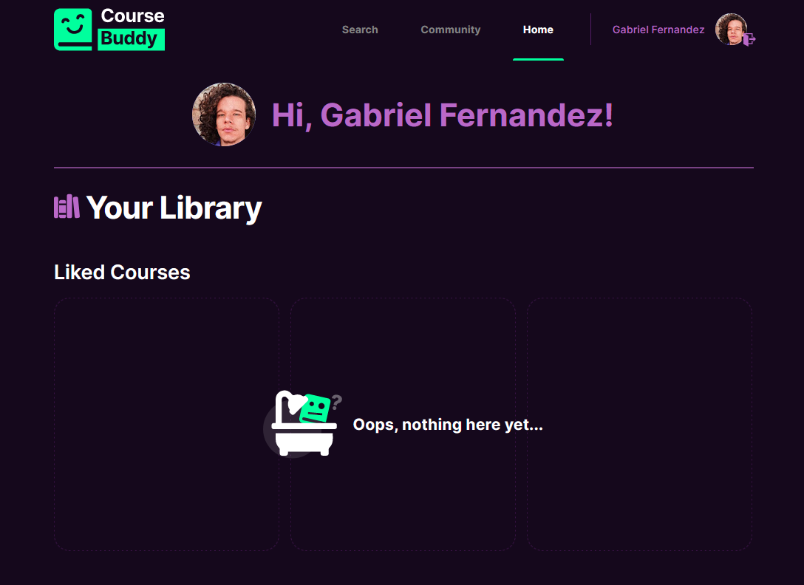

<h1 align="center">
  CourseBuddy
</h1>
<h1 align="center">
    
    
</h1>

<br>

## 💻 Project

We believe that every student is a potential content producer, and if their content requires a place to be published to the world wide community, here we are.

More about CB [here](https://coursebuddy.tk/about)

## 🧪 Technologies

This project was made using the followings Technologies:

- [React](https://pt-br.reactjs.org/)
- [Typescript](https://pt-br.reactjs.org/)
- [NextJS](https://nextjs.org/)
- [Chakra UI](https://chakra-ui.com/)
- [Supabase](https://chakra-ui.com/)
- [Yup](https://github.com/jquense/yupp)
- [React Hook Form](https://react-hook-form.com/)
- [React Icons](https://react-icons.github.io/react-icons/)

## 🪐 Running

To run the application...

```bash
# Clone the repository
$ git clone https://github.com/seufernandez/coursebuddy.git


# Install all dependencies
$ yarn


# Starting App
$ yarn start
```

App will be available on port: http://localhost:3000.

---

Made with 🧡 by Gabriel Fernandes
